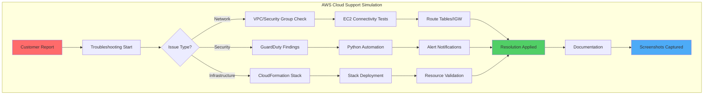
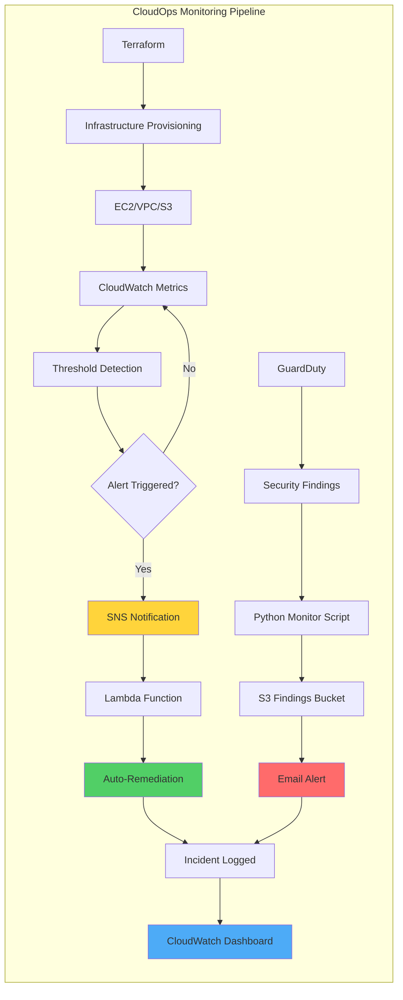
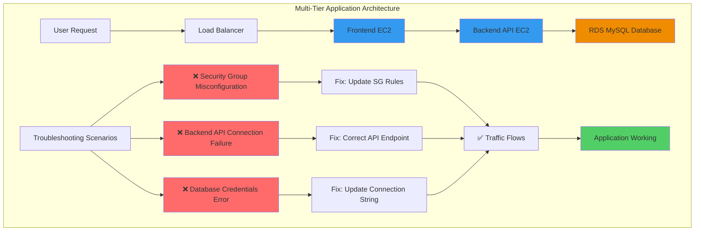

# 👋 Charles Bucher

**Self-Taught Cloud Engineer | AWS | Python | Terraform**

📍 Pinellas Park, Florida  
✉️ quietopscb@gmail.com  
🔗 [GitHub](https://github.com/charles-bucher) • [LinkedIn](https://linkedin.com/in/charles-bucher-cloud)

---

## 👨‍💻 About Me

I'm building cloud infrastructure skills through hands-on AWS projects. Coming from a non-traditional background, I'm self-teaching cloud engineering, DevOps practices, and automation to transition into tech.

**What I'm Learning:**
- AWS core services (EC2, S3, VPC, CloudFormation, Lambda, GuardDuty)
- Infrastructure as Code with Terraform and CloudFormation
- Python automation and Boto3 SDK
- Cloud security and monitoring practices

**Current Focus:** Building portfolio projects that demonstrate practical AWS troubleshooting and automation skills for Cloud Support and DevOps roles.

---

## 🛠️ Technical Skills

**Cloud Platform:** AWS (EC2, S3, VPC, CloudFormation, CloudWatch, GuardDuty, Security Groups, IAM)

**Infrastructure as Code:** Terraform • CloudFormation

**Languages & Scripting:** Python • Bash • PowerShell

**Tools & Platforms:** Git • VS Code • AWS CLI • Linux • Windows Server

**Learning:** Docker • Kubernetes • CI/CD pipelines

---

## 📂 Featured Projects

### 🔧 [AWS_Cloud_Support_Sim](https://github.com/charles-bucher/AWS_Cloud_Support_Sim)

Hands-on AWS troubleshooting scenarios simulating cloud support workflows.

**What I Built:**
- EC2 network connectivity diagnostics
- Security group configuration and management
- CloudFormation infrastructure deployment
- GuardDuty security monitoring with Python automation
- CloudWatch metrics and alerting

**Tech Stack:** AWS (EC2, VPC, S3, CloudFormation, GuardDuty, CloudWatch) • Python • Boto3 • Git

🏗️ Architecture Diagram

📸 Implementation Screenshots

#### EC2 Network Connectivity Testing

*Validated VPC configuration, route tables, and Internet Gateway with ping diagnostics (59ms avg latency)*

---

#### Security Group Configuration

*Configured inbound rules for HTTPS (443) and SSH (22) with least-privilege access*

---

#### CloudFormation Stack Deployment

*Deployed EC2 troubleshooting environment with CloudFormation (CREATE_COMPLETE status)*

---

#### Git Version Control Workflow

*Established professional Git repository with Python virtual environment and modular structure*

---

#### GuardDuty Security Monitoring

*Automated security findings monitoring with Python and Boto3 SDK*

---

### 🔧 [AWS_CloudOps_Suite](https://github.com/charles-bucher/AWS_Cloudops_Suite)

Full CloudOps pipeline with monitoring, alerting, and Terraform provisioning.

**What I Built:**
- Automated incident monitoring and alerting
- Terraform infrastructure provisioning
- CloudWatch dashboards and metrics
- Security scanning with GuardDuty

**Tech Stack:** Terraform • AWS CloudWatch • Python • GuardDuty • S3

🏗️ CloudOps Workflow Diagram

📸 Implementation Screenshots

#### CloudWatch Monitoring Dashboard

*Real-time CPU utilization monitoring with custom metrics and alarms*

---

#### GuardDuty Automated Findings Monitor

*Python script continuously monitors GuardDuty for security findings with email alerts*

---

#### S3 Bucket Management

*Configured S3 buckets for Terraform state and GuardDuty findings storage*

---

#### Terraform Infrastructure State

*Terraform v1.13.2 managing infrastructure state for reproducible deployments*

---

### 🔧 [Multi-Tier-App-Troubleshooting-Playground](https://github.com/charles-bucher/Multi-Tier-App-Troubleshooting-Playground)

Simulates a broken multi-tier application for troubleshooting practice.

**What I Built:**
- Frontend, backend, and database layer deployment
- Intentional misconfigurations for troubleshooting scenarios
- Step-by-step resolution documentation

**Tech Stack:** AWS (EC2, RDS, VPC) • CloudFormation • Python • MySQL

🏗️ Multi-Tier Architecture Diagram

📸 Implementation Screenshots

#### Multi-Tier Application Architecture

*Three-tier application deployed across frontend, backend, and database layers*

---

#### Troubleshooting Workflow

*Systematic approach to identifying root cause across application tiers*

---

#### Resolution Applied

*Application restored to working state after fixing misconfigurations*

---

## 📊 GitHub Stats

---

## 🎯 Current Goals

**Short-term (Next 3 months):**
- Complete AWS Solutions Architect Associate certification
- Build automated cost optimization tool
- Add CI/CD pipeline with GitHub Actions
- Contribute to open-source AWS projects

**Medium-term (6-12 months):**
- Land first Cloud Support Engineer or Junior DevOps role
- Build production-ready monitoring solutions
- Implement disaster recovery automation
- Expand portfolio with serverless projects (Lambda, API Gateway)

---

## 📚 Learning Journey

I'm documenting everything I learn through practical projects. Each repository includes:
- Working code with clear documentation
- Screenshots proving implementations work
- Architecture diagrams showing system design
- Setup instructions for reproducibility
- Real troubleshooting scenarios

**Current Study Plan:**
- AWS Solutions Architect Associate prep (Adrian Cantrill course)
- Python automation for AWS (Boto3 SDK)
- Terraform infrastructure patterns
- Cloud security best practices

---

## 🤝 Let's Connect

I'm actively looking for opportunities in:
- Cloud Support Engineering
- Junior DevOps Engineering  
- IT Infrastructure roles
- AWS technical support

**Open to:** Entry-level positions, apprenticeships, contract work, remote opportunities

📧 **Email:** quietopscb@gmail.com  
💼 **LinkedIn:** [charles-bucher-cloud](https://linkedin.com/in/charles-bucher-cloud)  
🐙 **GitHub:** [charles-bucher](https://github.com/charles-bucher)

---

## 📝 Recent Activity

- 🔨 Building GuardDuty automated security monitoring
- 📖 Studying for AWS Solutions Architect certification
- 🐍 Writing Python scripts for AWS automation
- 📚 Learning Terraform infrastructure patterns
- 💻 Documenting troubleshooting scenarios with screenshots

---

## 💡 Philosophy

**Learning by doing.** Every project is hands-on, reproducible, and documented. I focus on building practical solutions that demonstrate real-world cloud support skills. No fluff, just working code and clear documentation.

**Why I'm different:** I'm not coming from a traditional CS background. I'm bringing problem-solving skills, self-motivation, and the ability to learn quickly. Every commit represents something I've actually built and tested.

---

*"The best way to learn cloud engineering is to break things, fix them, and document the process."*

---

