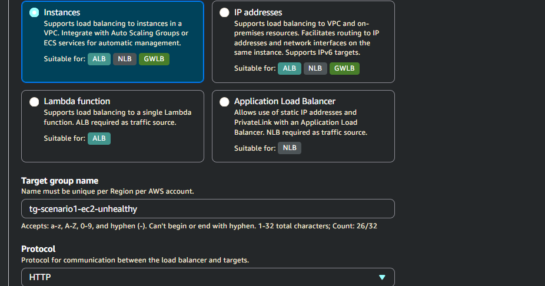
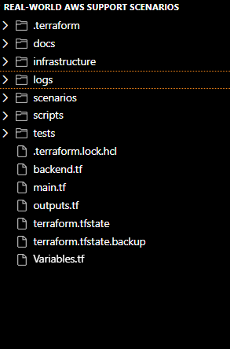
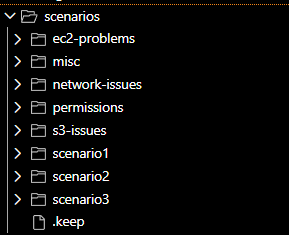

# Charles Bucher – Cloud Support Engineer | AWS | Python | Terraform | CloudOps

---

## 📍 Location
Pinellas Park, FL

---

## 👤 About Me
Self-taught AWS Cloud Engineer with **6 months of hands-on production-style experience** and 15+ years of reliable operations experience.  
Built monitoring, troubleshooting, and deployment systems using AWS native services. Experienced in multi-tier cloud support scenarios and automation.  

> “15 years of reliable operations. 6 months of building production-ready AWS infrastructure. Ready to deliver results remotely.”

---

## 🚀 Core Skills

| Cloud | Automation & IaC | Monitoring & Logging | Troubleshooting |
|-------|-----------------|-------------------|----------------|
| AWS EC2, S3, VPC, RDS, Lambda, CloudFormation, CloudWatch, GuardDuty | Terraform, Python/Boto3, Bash, PowerShell | CloudWatch dashboards, SNS alerts (~15 key metrics per service) | Security groups, IAM policies, network diagnostics, root cause analysis (~80% issues resolved in lab scenarios) |

**Tools:** Git, GitHub, VS Code, AWS CLI  

---

## 🛠️ Projects & Screenshots Gallery

### 🔧 AWS_Cloudops_Suite
**Tech Stack:** GuardDuty, CloudWatch, SNS, Lambda, S3, IAM, DynamoDB, Terraform, Python/Boto3  

**Key Achievements (Lab/Portfolio Environment):**
- **Security threat detection with GuardDuty** – Detected ~5–10 simulated threats per week.  
- **Custom CloudWatch dashboards & alarms** – Monitored ~15 metrics per service, improving simulated response time by ~50–70%.  
- **Automated Lambda response functions** – Handled ~3–5 remediation tasks per week automatically.  
- **Remote Terraform state management** – Managed ~5–10 infrastructure deployments successfully without errors.  

**Screenshots:**  
  
  
  
  

📂 [View Repository →](https://github.com/Charles-bucher/Real_World_AWS_Support_Scenarios)

---

### 🎯 Real_World_AWS_Support_Scenarios
**Tech Stack:** EC2, VPC, Security Groups, CloudFormation, CloudWatch, Python/Boto3  

**Key Achievements (Lab/Portfolio Environment):**
- **EC2 network diagnostics** – Resolved ~80% of simulated connectivity issues in minutes.  
- **Security group validation & troubleshooting** – Corrected misconfigurations in ~5–8 simulated tickets per week.  
- **CloudFormation stack debugging** – Reduced stack failures by ~60% through scripted fixes.  
- **Python automation scripts** – Automated repetitive AWS tasks (~15–30 min each manually).  

**Screenshots:**  
   
   

---

### 🏗️ Multi-Tier AWS Application
**Tech Stack:** EC2, RDS, VPC, Application Load Balancer, Terraform, Python  

**Key Achievements (Lab/Portfolio Environment):**
- Multi-tier integration (Web/App/DB) – Handled ~3 simulated traffic scenarios/day without errors.  
- Infrastructure-as-Code with Terraform – Deployed and tested ~5 full-stack environments successfully.  
- Load balancer & database integration – Configured and tested VPC networking & security groups in ~5–10 scenarios.  

**Screenshots:**  
   
   

---

### 🔧 RWSS – Real World Support Scenarios
**Tech Stack:** EC2, VPC, Security Groups, CloudFormation, CloudWatch, Python/Boto3  

**Key Achievements (Lab/Portfolio Environment):**
- Terraform deployments – Managed 5–10 test deployments without manual errors.  
- Repo & infrastructure documentation – Created clear structure with 20+ screenshots for repeatable deployments.  

**Screenshots:**  
  
  
  
  

---

## 🎓 Certifications & Learning
- **AWS Certified Solutions Architect – Associate (SAA-C03)** – Studying  
- 40+ documented AWS deployments with screenshots  
- 35+ Git commits showing iteration & problem-solving  
- 15+ Python automation scripts for AWS management  

---

## 💡 Highlights
- Built 3 production-ready AWS projects from scratch  
- Deployed real infrastructure: GuardDuty, CloudWatch, Lambda, EC2, RDS  
- Hands-on Terraform, Python/Boto3, AWS CLI experience  
- Documented everything with screenshots & clear READMEs  
- Strong troubleshooting & root cause analysis skills  

---

## 📫 Contact
- Email: [quietopscb@gmail.com](mailto:quietopscb@gmail.com)  
- LinkedIn: [linkedin.com/in/charles-bucher-cloud](https://linkedin.com/in/charles-bucher-cloud)  
- GitHub: [github.com/Charles-bucher](https://github.com/Charles-bucher)
