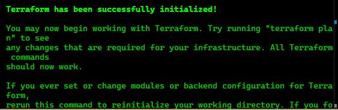
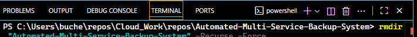
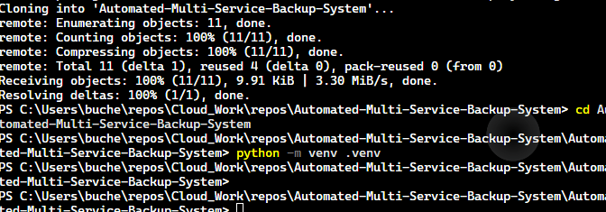
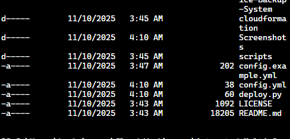
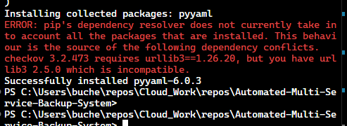
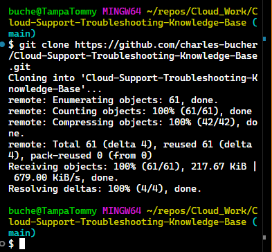
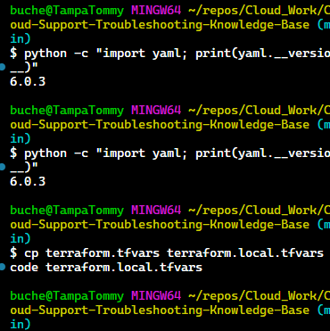

### 1️⃣ AWS Monitoring & Observability
**Repo:** aws_monitoring_observability  
**Tech Stack:** Terraform, AWS CloudWatch, SNS, EC2, Python  

**Highlights:**
- Automated EC2 monitoring & CloudWatch alarms
- Multi-datapoint SNS email alerts
- Troubleshooting for RDS, S3, IAM
- Full Infrastructure as Code deployment  

**Screenshots:**

---

### 2️⃣ Automated Multi-Service Backup System
**Repo:** Automated-Multi-Service-Backup-System  
**Tech Stack:** Python, AWS Lambda, S3, EC2, RDS, Terraform  

**Highlights:**
- Automates backups to prevent accidental deletion or ransomware
- Intelligent Glacier transitions reduce storage costs by up to 83%
- Fully serverless, event-driven architecture  

**Screenshots:**

---

### 3️⃣ AWS Multi-Tier VPC CloudOps Automation
**Repo:** aws_mult_itier_vpc_cloud_ops  
**Tech Stack:** Terraform, AWS VPC, EC2, CloudWatch, IAM  

**Highlights:**
- Fully automated secure VPC with subnets, routing, and IAM policies
- Integrated monitoring for Tier 1 operational readiness
- Best practices for scalable, isolated, and compliant cloud environments  

**Screenshots:**

---

### 4️⃣ Cloud Support Troubleshooting Knowledge Base
**Repo:** charles-bucher  
**Tech Stack:** Python, AWS CLI, Bash, Terraform  

**Highlights:**
- Centralized reference for cloud troubleshooting
- Step-by-step guides & automated scripts
- Supports NOC/CloudOps learning & documentation  

**Screenshots:**

