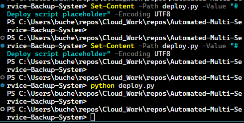

# 👨‍💻 Charles Bucher | Cloud Support & DevOps Engineer

[LinkedIn](https://www.linkedin.com/in/charles-bucher-26598728b/) | [Portfolio](https://charles-bucher.github.io) | [Email](mailto:quietopscb@gmail.com)

---

## 🚀 About Me
Hands-on Cloud Support & DevOps Engineer specializing in AWS troubleshooting, monitoring, and automation. I build production-ready projects that demonstrate practical cloud operations skills.

**Open to:** Cloud Support Engineer (Tier 1/2) | Junior DevOps | NOC/CloudOps Roles

**Core Skills & Tools:**
- Tier 1 Cloud Support & NOC Monitoring
- AWS: EC2, S3, Lambda, CloudWatch, SNS, GuardDuty, IAM
- Incident Response & Troubleshooting
- Automation & Infrastructure as Code: Python, Bash, Terraform
- CI/CD Pipelines: GitHub Actions, AWS CodePipeline

---

## 📂 Featured Projects

### 1️⃣ AWS Monitoring & Observability
End-to-end CloudWatch monitoring with real-world support scenarios.

**Repo:** [aws_monitoring_observability](https://github.com/charles-bucher/aws_monitoring_observability)  
**Tech Stack:** Terraform, AWS CloudWatch, SNS, EC2, Python  

**Highlights:**
- Automated EC2 monitoring & CloudWatch alarms
- Multi-datapoint SNS email alerts
- Troubleshooting for RDS, S3, IAM
- Full Infrastructure as Code deployment

**Screenshots:**

---

### 2️⃣ Cloud Support Troubleshooting Knowledge Base
Interactive knowledge base for Tier 1 cloud support technicians.

**Repo:** [charles-bucher](https://github.com/charles-bucher/charles-bucher)  
**Tech Stack:** Python, AWS CLI, Bash, Terraform  

**Highlights:**
- Centralized reference for cloud troubleshooting
- Step-by-step guides & automated scripts
- Supports NOC/CloudOps learning & documentation

**Screenshots:**

---

### 3️⃣ Automated Multi-Service Backup System
Serverless backup system for EC2, RDS, and S3 to prevent data loss and optimize costs.

**Repo:** [Automated-Multi-Service-Backup-System](https://github.com/charles-bucher/Automated-Multi-Service-Backup-System)  
**Tech Stack:** Python, AWS Lambda, S3, EC2, RDS, Terraform  

**Highlights:**
- Automates backups to prevent accidental deletion or ransomware issues
- Intelligent Glacier transitions to reduce storage costs by up to 83%
- Fully serverless, event-driven architecture

**Screenshots:**

---

### 4️⃣ CloudOps GuardDuty Automation
Automated threat detection and incident response using AWS GuardDuty and CloudWatch.

**Repo:** [cloudOps-guardDuty-automation](https://github.com/charles-bucher/cloudOps-guardDuty-automation)  
**Tech Stack:** Terraform, Python, CloudWatch, SNS, GuardDuty  

**Highlights:**
- Detects security threats proactively
- Triggers automated remediation workflows
- Integrates with CI/CD pipelines for continuous monitoring

**Screenshots:**

---

### 5️⃣ AWS Multi-Tier VPC CloudOps Automation
Secure, automated multi-tier VPC setup for CloudOps simulations.

**Repo:** [aws_mult_itier_vpc_cloud_ops](https://github.com/charles-bucher/aws_mult_itier_vpc_cloud_ops)  
**Tech Stack:** Terraform, AWS VPC, EC2, CloudWatch, IAM  

**Highlights:**
- Fully automated secure VPC with subnets, routing, and IAM policies
- Integrated monitoring for Tier 1 operational readiness
- Best practices for scalable, isolated, and compliant cloud environments

**Screenshots:**

---

## 🛠 About This Repo
This repository, `charles-bucher/charles-bucher`, is a special profile README that showcases my skills, projects, and hands-on CloudOps experience.

**Topics:** python, docker, aws, security, devops, lambda, automation, cloud-monitoring, ec2, terraform, s3, vpc, cicd, cloud-support

© 2025 Charles Bucher
