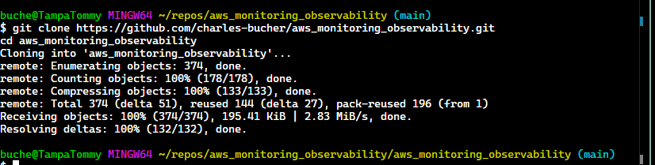
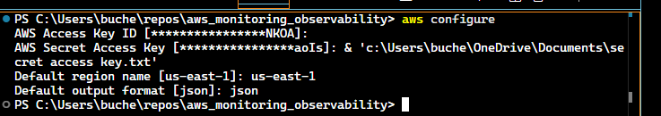
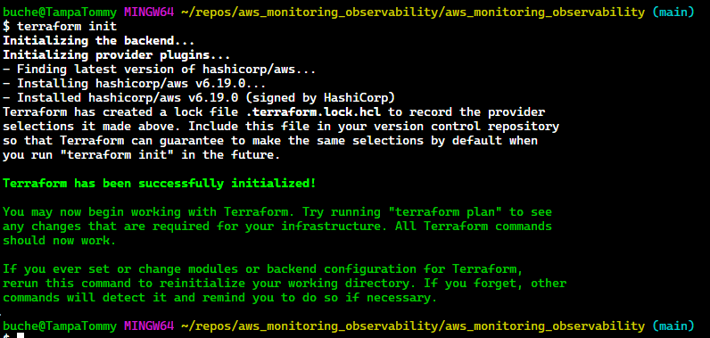
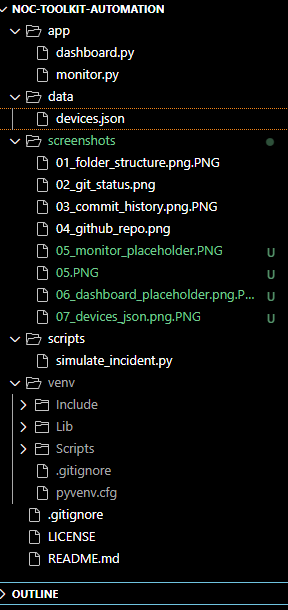
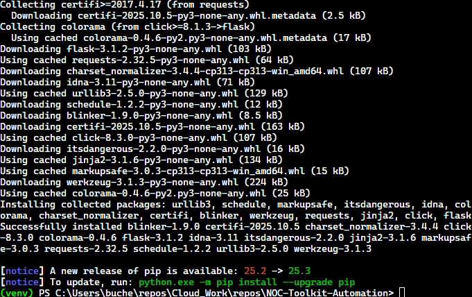
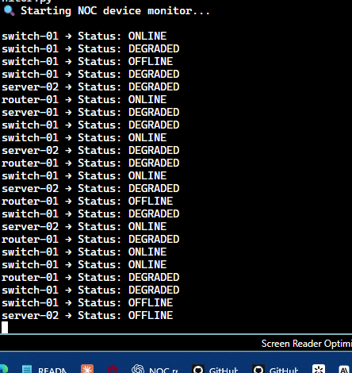
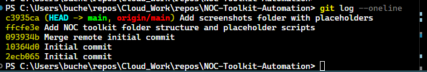
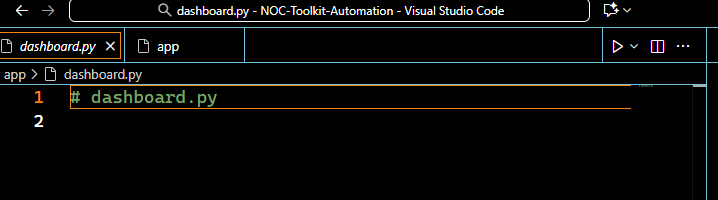
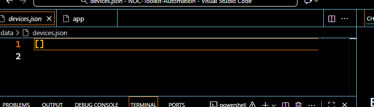

# Charles Bucher 👋
**AWS Cloud Engineer | Infrastructure Automation Specialist**  
Building cost-effective, reliable cloud solutions that prevent downtime and save money.  

📍 Florida | 📧 quietopscb@gmail.com | 🌐 [Portfolio](https://charles-bucher.github.io)  

---

## 🔧 Skills & Technologies
- **Cloud:** AWS (EC2, VPC, CloudWatch, GuardDuty, Lambda)  
- **Automation & IaC:** Terraform, Python, CI/CD, GitHub Actions  
- **Monitoring & NOC:** CloudOps, observability, alerting, dashboards  
- **DevOps Tools:** Docker, Flask, VS Code  

---

## 📂 Repositories & Projects

### 1️⃣ AWS Monitoring & Observability
**Goal:** Fast incident detection and automated response with CloudWatch.  
**Workflow:** Spin up EC2 → monitor metrics → detect anomalies → alert team.  

**Technologies:** Python, AWS, CloudWatch, CloudOps  

  
  
  
  

🎬 **Optional GIF Placeholder:** `Screenshots/aws_monitoring_workflow.gif` showing live alerts/metrics flow.  

[Repository Link](https://github.com/charles-bucher/aws_monitoring_observability)

---

### 2️⃣ CloudOps GuardDuty Automation
**Goal:** Proactive threat detection and automated incident response using GuardDuty + Terraform.  
**Workflow:** Terraform deploy → GuardDuty alerts → automated response → CI/CD updates → GitHub push.  

**Technologies:** Terraform, AWS, GuardDuty, CloudWatch, CI/CD  

  
  
  

🎬 **Optional GIF Placeholder:** `Screenshots/gd_workflow.gif` showing GuardDuty alert triggering automated response.  

[Repository Link](https://github.com/charles-bucher/cloudOps-guardDuty-automation)

---

### 3️⃣ AWS Multi-Tier VPC CloudOps
**Goal:** Secure, scalable multi-tier VPC architecture using Terraform.  
**Workflow:** Terraform deploy → network provisioning → IAM policy enforcement → monitoring setup.  

**Technologies:** Terraform, AWS, Networking, CloudOps  

  

🎬 **Optional GIF Placeholder:** `Screenshots/vpc_deploy.gif` showing Terraform network deployment.  

[Repository Link](https://github.com/charles-bucher/aws_mult_itier_vpc_cloud_ops)

---

### 4️⃣ NOC Toolkit Automation
**Goal:** Automate real-world network monitoring, alerting, and dashboard visualization.  
**Workflow:** Repo setup → environment setup → Python monitoring scripts → output dashboards → devices JSON processed → alerts triggered.  

**Technologies:** Python, AWS, Flask, DevOps, Monitoring  

  
  
  
  
  
  
  
  

🎬 **Optional GIF Placeholder:** `Screenshots/NOC_live_dashboard.gif` showing alerts and dashboard updates in real-time.  

[Repository Link](https://github.com/charles-bucher/NOC-Toolkit-Automation)

---

## 📜 Certifications Alignment
| Repo | Cert Alignment |
|------|----------------|
| AWS Monitoring & Observability | Cloud Practitioner, SAA, SysOps, DevOps Pro |
| CloudOps GuardDuty Automation | Security Specialty, SAA, DevOps Pro |
| AWS Multi-Tier VPC CloudOps | SAA, Networking Specialty, DevOps Pro |
| NOC Toolkit Automation | SysOps, Cloud Practitioner, DevOps entry |

---

## 📈 Career Focus
I build **hands-on cloud projects** that demonstrate operational troubleshooting, automation, and security. My work is aligned with AWS certifications to maximize career opportunities in cloud support, DevOps, and CloudOps.

---

*Let’s build the cloud smarter, faster, and more secure.* 🚀
