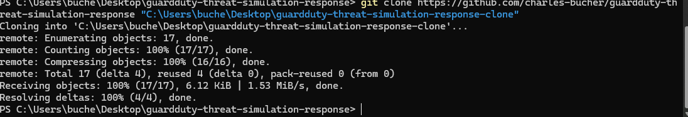
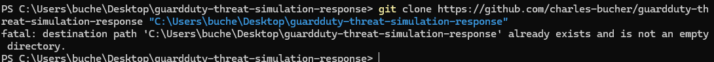

# 👨‍💻 Charles Bucher | Cloud Support & DevOps Engineer

[LinkedIn](https://www.linkedin.com/in/charles-bucher-26598728b/) | [Portfolio](https://charles-bucher.github.io) | [Email](mailto:quietopscb@gmail.com)

---

## 🚀 About Me
Hands-on Cloud Support & DevOps Engineer specializing in AWS troubleshooting, monitoring, and automation. I build production-ready projects demonstrating practical cloud operations skills.

Open to: Cloud Support Engineer (Tier 1/2) | Junior DevOps | NOC/CloudOps Roles

---

## Core Skills & Tools
- Tier 1 Cloud Support & NOC Monitoring  
- AWS: EC2, S3, Lambda, CloudWatch, SNS, GuardDuty, IAM  
- Incident Response & Troubleshooting  
- Automation & Infrastructure as Code: Python, Bash, Terraform  
- CI/CD Pipelines: GitHub Actions, AWS CodePipeline  

---

## 📂 Featured Projects

### 1️⃣ AWS Monitoring & Observability
**Repo:** [aws_monitoring_observability](https://github.com/charles-bucher/aws_monitoring_observability)  
**Tech Stack:** Terraform, AWS CloudWatch, SNS, EC2, Python  

**Highlights:**
- Automated EC2 monitoring & CloudWatch alarms  
- Multi-datapoint SNS email alerts  
- Troubleshooting for RDS, S3, IAM  
- Full Infrastructure as Code deployment  

**Screenshots:**

  
  
  

---

### 2️⃣ Automated Multi-Service Backup System
**Repo:** [Automated-Multi-Service-Backup-System](https://github.com/charles-bucher/Automated-Multi-Service-Backup-System)  
**Tech Stack:** Python, AWS Lambda, S3, EC2, RDS, Terraform  

**Highlights:**
- Automates backups to prevent accidental deletion or ransomware  
- Intelligent Glacier transitions reduce storage costs by up to 83%  
- Fully serverless, event-driven architecture  

**Screenshots:**

  
  
  

---

### 3️⃣ AWS Multi-Tier VPC CloudOps Automation
**Repo:** [aws_mult_itier_vpc_cloud_ops](https://github.com/charles-bucher/aws_mult_itier_vpc_cloud_ops)  
**Tech Stack:** Terraform, AWS VPC, EC2, CloudWatch, IAM  

**Highlights:**
- Fully automated secure VPC with subnets, routing, and IAM policies  
- Integrated monitoring for Tier 1 operational readiness  
- Best practices for scalable, isolated, and compliant cloud environments  

**Screenshots:**

  
  
  

---

### 4️⃣ Cloud Support Troubleshooting Knowledge Base
**Repo:** [charles-bucher](https://github.com/charles-bucher/charles-bucher)  
**Tech Stack:** Python, AWS CLI, Bash, Terraform  

**Highlights:**
- Centralized reference for cloud troubleshooting  
- Step-by-step guides & automated scripts  
- Supports NOC/CloudOps learning & documentation  

**Screenshots:**

  
  
  

---

### 5️⃣ CloudOps GuardDuty Automation
**Repo:** [cloudOps-guardDuty-automation](https://github.com/charles-bucher/cloudOps-guardDuty-automation)  
**Tech Stack:** Terraform, Python, CloudWatch, SNS, GuardDuty  

**Highlights:**
- Detects security threats proactively  
- Triggers automated remediation workflows  
- Integrates with CI/CD pipelines for continuous monitoring  

**Screenshots:**

  
  
  

---

## 🛠 About This Repo
This repository, `charles-bucher/charles-bucher`, is a special profile README showcasing my skills, projects, and hands-on CloudOps experience.

**Topics:** python, docker, aws, security, devops, lambda, automation, cloud-monitoring, ec2, terraform, s3, vpc, cicd, cloud-support  

© 2025 Charles Bucher
