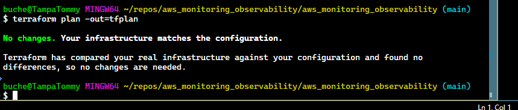
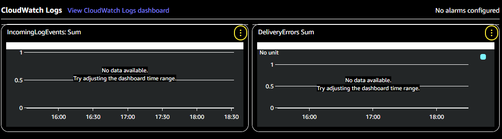
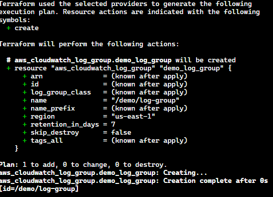

# Charles Bucher

**AWS Cloud Engineer | Infrastructure Automation Specialist**

Building cost-effective cloud solutions that prevent downtime & save money.  
🧠 AWS | Terraform | Python | Bash | DevOps Automation

---

## 📸 Project Screenshots

Below are visual examples from each of my key cloud engineering projects.  
Each folder inside `/screenshots` corresponds to one project.

---

### 🚀 Automated Multi-Service Deployment
Path: `assets/Automated-Multi-Service-assets/`


---

### 📊 AWS Monitoring & Observability
Path: `assets/aws_monitoring_observability_assets/`









---

### 🏗️ Multi-Tier VPC Cloud Architecture
Path: `assets/aws_mult_itier_vpc_cloud_assets/`

ls assets/aws_mult_itier_vpc_cloud_screenshots

---

### 🛡️ CloudOps GuardDuty Automation
Path: `assets/cloudOps-guardDuty-automation-assets/`

ls assets/cloudops-guardduty-automation-screenshots
---

### 🧰 Cloud Support Troubleshooting
Path: `assets/Cloud-Support-Troubleshooting-assets/`


---

## ⚙️ How to Update Screenshots Automatically

You can generate all Markdown image links for every folder with this script:

```bash
#!/bin/bash
echo "# 📸 Project Screenshots" > SCREENSHOTS.md
for dir in assets/*; do
  [ -d "$dir" ] || continue
  dirname=$(basename "$dir")
  echo -e "\n## ${dirname}" >> SCREENSHOTS.md
  find "$dir" -type f \( -iname "*.png" -o -iname "*.jpg" -o -iname "*.jpeg" \) | while read img; do
    echo "" >> SCREENSHOTS.md
  done
done
<!-- Auto-generated gallery -->

