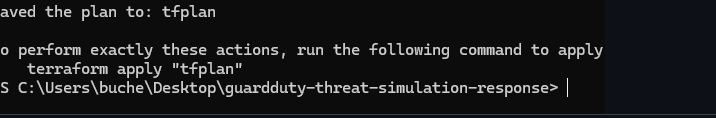

# 👋 Hi, I’m Charles Bucher

**AWS Cloud Support Engineer | CloudOps | NOC | Python Automation**  
📍 Florida | ✉️ quietopscb@gmail.com | 🌐 [Portfolio](https://charles-bucher.github.io/) | GitHub: [charles-bucher](https://github.com/charles-bucher/charles-bucher) | LinkedIn: [linkedin.com/in/charles-bucher-26598728b](https://www.linkedin.com/in/charles-bucher-26598728b/)

---

## 🔹 About Me
Hands-on Cloud Support Engineer with practical experience in **AWS monitoring, incident response, and automation**. Self-taught and building in public through real-world CloudOps projects using **Python, Terraform, and AWS services**.  

I focus on solving problems fast, automating repetitive tasks, and keeping cloud environments secure and reliable. Actively seeking **Tier 1/2 Cloud Support, NOC, or CloudOps roles** to make an immediate impact.

---

## 🔧 Core Skills

**Cloud Platforms:** AWS (EC2, S3, Lambda, CloudWatch, GuardDuty, RDS, IAM, VPC)  
**Automation & Scripting:** Python (boto3), Bash, Terraform, CI/CD pipelines (GitHub Actions, CodePipeline)  
**CloudOps & NOC:** Monitoring, Alerting, Incident Response, Troubleshooting, Operational Runbooks  
**Security & Observability:** Cloud Security Monitoring, Threat Detection, Anomaly Detection  
**Other Skills:** Linux troubleshooting, SOP creation, Documentation, Cloud Architecture Fundamentals  

---

## 📂 Projects & Hands-On Labs

### 1️⃣ [AWS Monitoring & Observability](https://github.com/charles-bucher/aws_monitoring_observability)
- **Goal:** Deploy a real-time monitoring pipeline for operational support  
- **What I did:** Configured CloudWatch metrics, alarms, dashboards, and SNS notifications  
- **Impact:** Reduced incident response time and enabled proactive alerts  
- **Tech:** AWS CloudWatch, Python, Terraform  
- **Status:** Complete & documented  

### 2️⃣ [CloudOps GuardDuty Automation](https://github.com/charles-bucher/cloudOps-guardDuty-automation)
- **Goal:** Automate cloud security threat detection and response  
- **What I did:** Built GuardDuty + CloudWatch + Terraform automation pipeline with CI/CD  
- **Impact:** Simulated NOC workflows for faster, reliable incident resolution  
- **Tech:** AWS GuardDuty, Python, Terraform, CI/CD  
- **Status:** Complete  

### 3️⃣ [AWS Troubleshooting Lab](https://github.com/charles-bucher/AWS_Troubleshooting_Lab) *(In Progress)*
- **Goal:** Build reusable scripts for common AWS support scenarios  
- **What I’m doing:** Python scripts using boto3 and AWS CLI to automate repetitive support tasks  
- **Impact:** Reduces manual troubleshooting and accelerates incident resolution  
- **Tech:** Python, boto3, AWS CLI  
- **Status:** Active development  

### 4️⃣ [Portfolio Website](https://charles-bucher.github.io/)
- **Goal:** Showcase CloudOps, monitoring, and automation projects  
- **Tech:** HTML, CSS, GitHub Pages  
- **Status:** Complete  

---

## 🎓 Learning Path & Certifications
- **AWS Cloud Practitioner** (Target: Feb 2026)  
- Hands-on labs: EC2, S3, Lambda, CloudWatch, IAM, GuardDuty, basic networking  
- Focus: CloudOps automation, NOC workflows, operational troubleshooting  

---

## ⚡ Why Work With Me
- 300+ GitHub contributions last year—consistent hands-on experience  
- Able to troubleshoot, automate, and resolve incidents independently  
- Real-world operational mindset: SOP creation, monitoring pipelines, security automation  
- Transparent, self-motivated, and ready to hit the ground running in Cloud Support or NOC roles  

---

## 📌 Let’s Connect
Reach out if you’re looking for someone who can take **CloudOps and NOC operations off your plate**, automate workflows, and deliver **fast, reliable results**.  

- 📧 quietopscb@gmail.com  
- 🌐 [Portfolio](https://charles-bucher.github.io/)  
- GitHub: [charles-bucher](https://github.com/charles-bucher/charles-bucher)  
- LinkedIn: [linkedin.com/in/charles-bucher-26598728b](https://www.linkedin.com/in/charles-bucher-26598728b/)

---

## 🖼 Screenshots & Visuals
| Screenshot | Description |
|-----------|-------------|
|  | GitHub push workflow for portfolio projects |
|  | Terraform plan output for infrastructure automation |
|  | Terraform apply confirmation & resources created |

---

*Portfolio, repos, and hands-on labs demonstrate a **real-world operational CloudOps skillset** ready to deploy immediately.*
