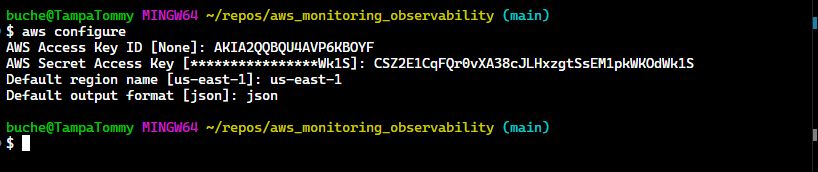

👋 Charles Bucher | AWS Cloud Support Engineer | CloudOps Automation | Monitoring & Security

Self-taught AWS engineer with 300+ GitHub contributions building monitoring, security automation, and troubleshooting solutions. Learning in public through hands-on projects with Python, Terraform, and AWS services.

📍 Pinellas Park, Florida (Remote) | 📧 quietopscb@gmail.com | 🌐 [Portfolio](charles-bucher.github.io) | 🔗 [LinkedIn](https://in/charles-bucher-26598728b) | 📋 [Indeed](https://profile.indeed.com/p/charlesb-x0xr5fx)

---

## 📂 Projects with Screenshots

### 🔹 AWS Monitoring & Observability Real-Time Monitoring Pipeline
Automated monitoring and alerting for EC2 instances via CloudWatch and SNS. Includes Terraform provisioning and CI/CD pipelines.

#### Screenshots

---

### 🔹 AWS Troubleshooting Lab
Step-by-step documentation of real AWS issues (EC2, S3, Lambda, IAM).

#### Screenshots

---

### 🔹 CloudOps GuardDuty Automation
Automated Security Threat Detection using AWS GuardDuty + EventBridge + SNS.

#### Screenshots

---

✅ **Folder structure reminder:**

charles-bucher/
├─ README.md
├─ screenshots/
│ ├─ AWS_monitoring_observability_screenshots/
│ ├─ AWS_Troubleshooting_Lab_screenshots/
│ └─ cloudOps-guardDuty-automation_screenshots/
