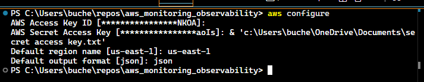

# 👨‍💻 Charles Bucher | Cloud Support & DevOps Engineer

---

## 🚀 About Me

Cloud Support & DevOps Engineer specializing in **AWS troubleshooting, monitoring, and automation**. I build production-ready projects that demonstrate practical cloud operations skills.

**Open to:** Cloud Support Engineer (Tier 1/2) | Junior DevOps | NOC/CloudOps Roles

---

## 📂 Featured Projects

### 📊 AWS Monitoring & Observability
**End-to-end CloudWatch monitoring with customer support scenarios**

**Tech Stack:** Terraform, AWS CloudWatch, SNS, EC2, Python

**Highlights:**
- Automated EC2 monitoring with CloudWatch alarms
- SNS email alerting with multi-datapoint evaluation
- Documented customer support scenarios RDS, S3, IAM troubleshooting)
- Complete Infrastructure as Code deployment

<table>
<tr>
<td width="25%">
<b>AWS Configuration</b>
</td>
<td width="25%">
<b>Repository Setup</b>
</td>
<td width="25%">
<b>Terraform Plan</b>
</td>
<td width="25%">
<b>Deployed</b>
</td>
</tr>
</table>

---

### 📚 Cloud Support Troubleshooting Knowledge Base
**Interactive knowledge base for Tier 1 cloud support technicians**

**Tech Stack:** Python, AWS CLI, Bash, Terraform

**Highlights:**
